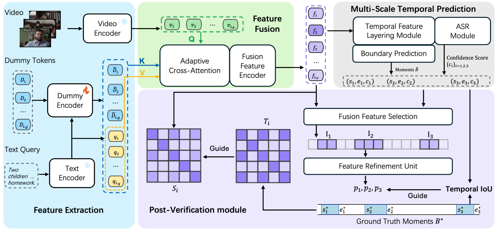

# When One Moment Isn’t Enough: Multi-Moment Retrieval with Cross-Moment Interactions

This repository is the official implementation of the paper **When One Moment Isn’t Enough: Multi-Moment Retrieval with Cross-Moment Interactions** (NeurIPS 2025)  
> Zhuo Cao, Heming Du, Bingqing Zhang, Xin Yu, Xue Li, Sen Wang 
> 
> The University of Queensland, Australia

[**Preparation**](#-Preparation) | [**Inference**](#-Inference) | [**Evaluation**](#-Evaluation) | [**Citation**](#-Citation) | [**Acknowledgements**](#-Acknowledgements)

<p align="center"></p>

## 🔨 Preparation

1. **Environment**
   ```bash
   conda create -n flashmmr python=3.12 -y
   conda activate flashmmr
   pip install -r requirements.txt
   ```
   We recommend Python 3.12.2 (same as FlashVTG environment setup).

2. **Features & annotation**
   - Download QVHighlights video and query features exactly as described in [FlashVTG](https://github.com/Zhuo-Cao/FlashVTG).
   - Download QV-M2 text features at [this link](https://www.dropbox.com/scl/fo/frltqeb887v877jkkvej1/AIjIvcrd72HdU3paRwDrYJU?rlkey=jwakppjgmsxklyuk8xuu8ne4r&st=t5odrh9a&dl=0).
   - Please find annotation files under `data/` and update any path fields that differ on your machine.
   - We provide checkpoints [here](https://www.dropbox.com/scl/fo/zu56dx7o889dym910203m/ABxQWd8tJuUUkI3C4_CEgz8?rlkey=t87wijuxii0ll93six6xwnsx1&st=x15l0nfu&dl=0). Please download and place them under `results/` directory. Configuration can be find in each ``opt.json`` file.

## ▶️ Inference

All entry points go through `FlashMMR/inference.py`. The script expects:

```bash
python FlashMMR/inference.py \
    data/MR.py \
    --resume results/<experiment>/model_best.ckpt \
    --eval_split_name val \
    --eval_path data/QV-M2/test.jsonl
```

**Argument quick reference**
- `data/MR.py`: nncore config that defines strides, pyramids, and generators.
- `--resume`: path to a checkpoint (e.g., `model_best.ckpt`). Required.
- `--eval_split_name`: `val` will compute metrics (needs GT); `test` skips evaluation.
- `--eval_path`: dataset JSONL containing query metadata + feature IDs.

Outputs are saved under `results/<experiment>/`, including raw submissions and, when possible, `_metrics.json`.

## 📊 Evaluation

If you want to evaluate on multi-moment retrieval task separately, you can use the standalone evaluation script:

```bash
python standalone_eval/eval.py \
    --submission_path results/<experiment>/best_hl_val_preds_nms_thd_0.7.jsonl \
    --gt_path data/QV-M2/test.jsonl \
    --save_path results/<experiment>/best_hl_val_preds_nms_thd_0.7_metrics.json
```

**Argument quick reference**
- `--submission_path`: path to the prediction file.
- `--gt_path`: path to the ground truth file.
- `--save_path`: path to save the evaluation results.

## 🎓 Citation

If you find FlashMMR useful for your research, please consider citing:

```
@InProceedings{cao2025flashmmr,
    author    = {Cao, Zhuo and Du, Heming and Zhang, Bingqing and Yu, Xin and Li, Xue and Wang, Sen},
    title     = {When One Moment Isn't Enough: Multi-Moment Retrieval with Cross-Moment Interactions},
    booktitle = {Advances in Neural Information Processing Systems (NeurIPS)},
    year      = {2025},
}
```

##  Acknowledgements
This work is supported by Australian Research Council (ARC) Discovery Project DP230101753 and the code is based on [FlashVTG](https://github.com/Zhuo-Cao/FlashVTG).